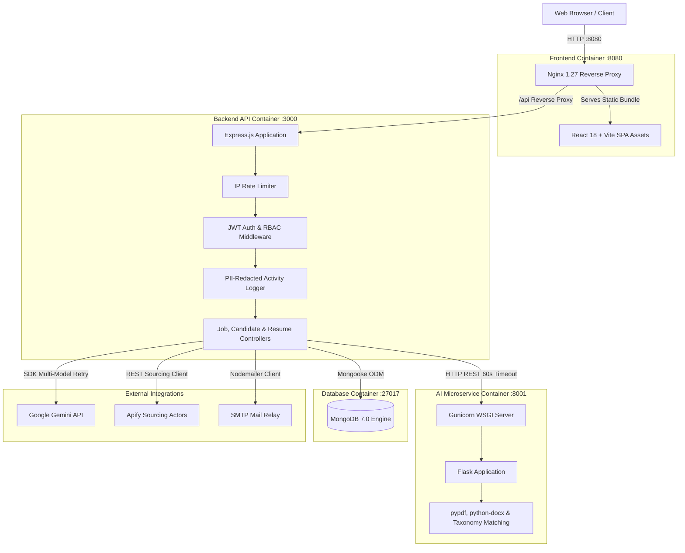
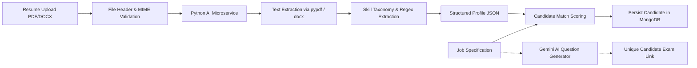

# Velocity

> **AI-Powered Recruitment & Candidate Intelligence Platform**

[](#cicd-workflows)
[](https://nodejs.org/)
[](https://react.dev/)
[](https://www.typescriptlang.org/)
[](https://www.python.org/)
[](https://www.docker.com/)
[](https://www.mongodb.com/)
[](#testing--quality)

Velocity is a full-stack recruitment intelligence platform designed to streamline hiring workflows. It combines multi-format resume parsing, automated candidate sourcing, AI-driven assessment generation, and a secure proctored candidate exam environment with enterprise-grade authorization and containerization.

---

## Table of Contents

1. [Overview & Problem Statement](#overview--problem-statement)
2. [Key Capabilities](#key-capabilities)
3. [System Architecture](#system-architecture)
4. [AI Candidate Intelligence Pipeline](#ai-candidate-intelligence-pipeline)
5. [End-to-End Request Flow](#end-to-end-request-flow)
6. [Technology Stack](#technology-stack)
7. [Core Modules](#core-modules)
8. [Authentication & Security Architecture](#authentication--security-architecture)
9. [API Reference](#api-reference)
10. [Testing & Quality Assurance](#testing--quality-assurance)
11. [Docker & Container Architecture](#docker--container-architecture)
12. [CI/CD Workflows](#cicd-workflows)
13. [Project Directory Structure](#project-directory-structure)
14. [Getting Started & Local Setup](#getting-started--local-setup)
15. [Environment Variables](#environment-variables)
16. [Product Walkthrough](#product-walkthrough)
17. [Engineering Highlights](#engineering-highlights)
18. [Known Limitations](#known-limitations)
19. [Future Roadmap](#future-roadmap)
20. [License & Attribution](#license--attribution)

---

## Overview & Problem Statement

Modern technical recruitment faces two persistent bottlenecks:
1. **Manual Sourcing & Ingestion Friction**: Recruiters manually sift through hundreds of unstructured resumes in varying formats (PDF, DOCX) and perform repetitive keyword searches across external candidate platforms.
2. **Evaluation & Integrity Disconnect**: Assessing technical applicants typically requires disjoint third-party testing tools with minimal proctoring, resulting in fragmented candidate tracking and high administrative overhead.

**Velocity solves this by providing a unified, self-hosted recruitment platform:**
- Extracts structured candidate profiles from unstructured PDF/DOCX resumes via an isolated Python NLP microservice.
- Automates candidate lead sourcing using web-scraping actors with built-in query caching.
- Dynamically generates domain-specific assessments using Google Gemini with multi-model fallback resiliency.
- Provides a candidate assessment portal with browser-level proctoring (fullscreen lock, tab-switching tracking, and camera verification).
- Enforces multi-tenant data isolation, role-based access control (Recruiter vs. Admin), and sensitive data redaction.

---

## Key Capabilities

- **Multi-Format Resume Intelligence**: Validates binary file headers (magic numbers), enforces 5MB limits, and extracts contact info, technical skills, education, and experience from PDF and DOCX files.
- **Automated Candidate Sourcing**: Integrates with external scraping actors (Apify) with SHA-256 query hashing and 24-hour TTL caching to eliminate redundant API spend.
- **AI Assessment Generation**: Leverages Google Gemini with multi-model failover (`gemini-2.5-flash` $\rightarrow$ `gemini-2.0-flash` $\rightarrow$ `gemini-2.5-flash-lite`) to generate contextual candidate tests.
- **Proctored Examination Portal**: Secure exam interface with WebRTC camera streaming, fullscreen enforcement, and tab-switch violation counters.
- **Enterprise Security**: Stateless JWT authentication, role-based route gating, SHA-256 password reset tokens, in-memory IP rate limiting, and automated PII redaction in audit logs.
- **Production Containerization**: Multi-stage Dockerfiles, non-root user execution, aligned timeout hierarchy, and automated GitHub Actions CI/CD gates.

---

## System Architecture

Velocity uses a decoupled, three-tier microservice architecture containerized with Docker Compose:



### Architecture Highlights
- **Nginx Ingress**: Serves pre-built static React bundle, injects security headers (`X-Frame-Options`, `X-Content-Type-Options`), enables gzip compression, and proxies `/api/*` traffic directly to Node.
- **Node.js Express Backend**: Houses all business logic, schema validation, rate limiting, and multi-tenant authorization.
- **Python AI Microservice**: Isolates CPU-bound document text extraction and regex pattern matching away from the Node event loop. Runs under production Gunicorn with 2 worker OS processes.
- **MongoDB Database**: Persistent document store with indexes on user emails, candidate jobs, search cache hashes, and exam tokens.

---

## AI Candidate Intelligence Pipeline



1. **Upload & Magic-Byte Validation**: File buffer checked for magic bytes (`%PDF-` for PDF, `PK\x03\x04` for DOCX) and size $\le$ 5MB.
2. **Text Extraction**: The Python service parses raw text without running client scripts.
3. **Information Extraction**: Extracts candidate metadata (Name, Email, Phone, LinkedIn) and matches skills against curated technical taxonomies.
4. **Scoring & Alignment**: The backend computes matching scores against required skills and experience defined in the Job Specification.
5. **AI Exam Synthesis**: Recruiter optionally triggers automated exam generation via Gemini to test candidate skills matching the job profile.

---

## End-to-End Request Flow

```
Recruiter Creates Job
  └── POST /api/jobs (JWT Authenticated, role: recruiter)
      └── Stored in MongoDB JobSpec collection

Candidate Sourcing
  └── POST /api/recruitment/search-candidates
      ├── Hash search parameters with SHA-256
      ├── Check MongoDB SearchCache (TTL: 24h)
      │   ├── Cache Hit: Return cached candidates immediately
      │   └── Cache Miss: Call Apify Actor -> clean/filter titles -> save to SearchCache
      └── Candidates returned and normalized for recruiter review

Resume Parsing & Ingestion
  └── POST /api/resume/parse (Multipart/Base64)
      ├── Backend validates size (5MB) and MIME signature
      ├── Dispatched to Python AI microservice (60s timeout)
      ├── Python extracts text, skills, contacts, education
      ├── Backend scores candidate against active job description
      └── Structured candidate record saved to MongoDB

Assessment & Proctoring
  └── POST /api/assessments/generate
      ├── Calls Gemini API (with fallback models) to synthesize exam questions
      ├── Recruiter reviews and publishes assessment
      └── Candidate receives exam token URL: /exam/:token
          ├── Fullscreen lock & visibility detection activated
          ├── WebRTC camera stream established for identity verification
          └── Submission evaluated and stored in ExamAttempt collection
```

---

## Technology Stack

| Category | Technology | Version | Purpose |
| :--- | :--- | :--- | :--- |
| **Frontend** | React | `18.3.1` | Single-page application UI |
| | TypeScript | `5.5.3` | Strict compile-time type safety |
| | Vite | `5.3.0` | Production build tooling and development server |
| | Tailwind CSS | `3.4.1` | Utility-first responsive styling |
| | Lucide React | `0.344.0` | UI iconography |
| **Backend** | Node.js | `20.x` LTS | Core REST API runtime environment |
| | Express.js | `4.19.2` | HTTP web application framework |
| | Mongoose | `9.0.1` | MongoDB Object Data Modeling (ODM) |
| | JWT (`jsonwebtoken`) | `9.0.2` | Stateless cryptographic session tokens |
| | Bcrypt | `6.0.0` | Salted password hashing (cost factor 10) |
| | Supertest | `7.0.0` | HTTP endpoint integration testing |
| **AI / Microservice**| Python | `3.11` | Microservice runtime environment |
| | Flask | `3.1.3` | Lightweight HTTP service routing |
| | Gunicorn | `21.2.0` | Production WSGI application server |
| | pypdf | `6.9.2` | PDF binary text extraction |
| | python-docx | `1.2.0` | DOCX OpenXML text extraction |
| | Google Gen AI SDK | `0.1.1` | Gemini API client for assessment generation |
| **Database** | MongoDB | `7.0` | Document database for multi-tenant storage |
| **Infrastructure** | Docker Engine | Multi-Stage | Production container isolation |
| | Docker Compose | `v2.x` | Multi-container stack orchestration |
| | Nginx | `1.27-alpine` | Frontend reverse proxy and static asset server |
| **Testing** | Jest | `29.7.0` | Backend unit and integration test runner |
| | Vitest | `4.1.11` | Frontend unit and component test runner |
| **External APIs** | Apify | REST API | Automated web candidate sourcing |
| | Google Gemini | REST API | LLM assessment question synthesis |
| | Nodemailer | `6.9.14` | Transactional email delivery |

---

## Core Modules

### 1. Authentication & Authorization
- Recruiter self-registration (`POST /api/auth/signup`) and session sign-in (`POST /api/auth/signin`).
- Secure password reset flow (`POST /api/auth/forgot-password` and `POST /api/auth/reset-password`) using SHA-256 hashed one-time tokens with 1-hour expiration and replay prevention.
- Role-based authorization (`admin` vs. `recruiter`) guarding administrative reporting and recruiter tenant workspaces.

### 2. Job Management
- CRUD operations for Job Specifications (`JobSpec`), defining positions, departments, required skill tags, experience ranges, and descriptions.
- Tenant scoping ensures recruiters can only view, edit, or delete their own job listings.
- Optimized candidate count calculation using MongoDB `$lookup` aggregations to eliminate N+1 database queries.

### 3. Candidate Sourcing & Caching
- Connects to Apify scrapers to source public candidate profiles matching title, location, and keywords.
- Multi-tier matching logic (`strict` exact title matches vs. `fallback` partial keyword matches).
- Integrated `SearchCache` storing SHA-256 query hashes with 24-hour expiration to optimize API costs.

### 4. Resume Intelligence
- Validates file extensions (`.pdf`, `.docx`), MIME types (`application/pdf`, `application/vnd.openxmlformats-officedocument.wordprocessingml.document`), and file magic bytes.
- Offloads text extraction to the Python microservice with 60-second timeouts, handling connection refused (`503`) and timeout (`504`) gracefully.
- Parses skills, experience, and contact info, mapping candidates to job specs with calculated matching scores.

### 5. AI Assessments & Proctoring
- Recruiter generates multi-topic assessments with automated question drafting powered by Google Gemini.
- Features multi-model fallback (`gemini-2.5-flash` $\rightarrow$ `gemini-2.0-flash` $\rightarrow$ `gemini-2.5-flash-lite`).
- Generates candidate exam tokens. The candidate exam interface enforces:
  - Fullscreen lock (`fullscreenchange` detection).
  - Tab switch and window blur tracking (`tabSwitchCount` increments).
  - Camera preview feed via HTML5 `getUserMedia` for visual identity verification.

### 6. Audit & Administrative Operations
- Dedicated admin portal routes (`/api/admin/*`) restricted to users with `role: admin`.
- Tracks recruiter logins, job creations, candidate searches, and parsing requests in MongoDB `Activity` collection.
- Sensitive parameters (passwords, tokens, cookies, auth headers) are automatically sanitized before persistence.

---

## Authentication & Security Architecture

```
Client Request
      │
      ▼
[IP Rate Limiter] ──> Exceeded? ──> HTTP 429 Too Many Requests
      │
      ▼
[CORS Origin Guard] ──> Disallowed Origin? ──> HTTP 403 Forbidden
      │
      ▼
[Body Parser Limit] ──> Payload > 10MB? ──> HTTP 413 Payload Too Large
      │
      ▼
[JWT Verification] ──> Invalid / Expired Token? ──> HTTP 401 Unauthorized
      │
      ▼
[Role Check (RBAC)] ──> Insufficient Privileges? ──> HTTP 403 Forbidden
      │
      ▼
[Tenant Isolation] ──> Queries strictly bound to req.user._id
      │
      ▼
[Safe Execution & Audit Logging (PII Redacted)]
```

### Verified Protections
- **Cryptographic Password Storage**: Passwords hashed with `bcrypt` (salt rounds: 10). Plaintext passwords never logged or stored.
- **Stateless Session Control**: Signed JWTs with configurable expiration (`JWT_EXPIRES_IN=7d`).
- **Cryptographic Token Hashing**: Password reset tokens are generated using `crypto.randomBytes(32)` and stored as SHA-256 hashes in MongoDB.
- **Tenant Isolation**: Job and candidate queries explicitly append `{ userId: req.user._id }` to prevent horizontal privilege escalation.
- **File Upload Hardening**: Multer configured with in-memory storage, 5MB file size limit, and binary magic-number validation to prevent disguised executable uploads.
- **Rate Limiting**: In-memory IP rate limiting (`20 req / 15 min` on authentication endpoints, `100 req / 15 min` globally).
- **Log Hygiene**: Automated sanitization scrubs tokens, passwords, cookies, email addresses, and MongoDB URIs from console logs and audit collections.
- **Non-Root Containers**: Backend runs under unprivileged user `node`; AI service runs under `appuser`.

---

## API Reference

All protected endpoints require the HTTP header: `Authorization: Bearer <token>`.

### Authentication Endpoints
| Method | Endpoint | Access | Description |
| :--- | :--- | :--- | :--- |
| `POST` | `/api/auth/signup` | Public | Register new recruiter account |
| `POST` | `/api/auth/signin` | Public | Authenticate user & receive JWT token |
| `POST` | `/api/auth/forgot-password` | Public | Generate SHA-256 hashed password reset token |
| `POST` | `/api/auth/reset-password` | Public | Reset password using one-time token |
| `GET` | `/api/auth/me` | Protected | Retrieve authenticated user profile |

### Job Management Endpoints
| Method | Endpoint | Access | Description |
| :--- | :--- | :--- | :--- |
| `GET` | `/api/jobs` | Recruiter / Admin | List jobs with candidate counts and pagination |
| `POST` | `/api/jobs` | Recruiter / Admin | Create a new Job Specification |
| `GET` | `/api/jobs/:id` | Recruiter / Admin | Retrieve job details by ID |
| `PUT` | `/api/jobs/:id` | Recruiter / Admin | Update job specification (owner-scoped) |
| `DELETE` | `/api/jobs/:id` | Recruiter / Admin | Remove job specification (owner-scoped) |

### Candidate & Sourcing Endpoints
| Method | Endpoint | Access | Description |
| :--- | :--- | :--- | :--- |
| `GET` | `/api/candidates` | Recruiter / Admin | List candidates with pagination and job filters |
| `GET` | `/api/candidates/:id` | Recruiter / Admin | Retrieve individual candidate record |
| `POST` | `/api/recruitment/search-candidates` | Recruiter / Admin | Source candidates via Apify scraper / search cache |
| `GET` | `/api/candidates/job-filters` | Recruiter / Admin | Retrieve candidate count aggregation by job |

### Resume Parsing Endpoints
| Method | Endpoint | Access | Description |
| :--- | :--- | :--- | :--- |
| `POST` | `/api/resume/parse` | Recruiter / Admin | Parse PDF/DOCX resume and match against job |

### Assessment & Exam Endpoints
| Method | Endpoint | Access | Description |
| :--- | :--- | :--- | :--- |
| `GET` | `/api/assessments` | Recruiter / Admin | List assessments created by recruiter |
| `POST` | `/api/assessments/generate` | Recruiter / Admin | Synthesize exam questions via Gemini AI |
| `POST` | `/api/assessments` | Recruiter / Admin | Manually create custom assessment |
| `GET` | `/api/assessments/exam/:token` | Public | Candidate retrieves exam payload via token |
| `POST` | `/api/assessments/exam/:token/submit` | Public | Candidate submits exam with proctoring telemetry |
| `GET` | `/api/assessments/submissions` | Recruiter / Admin | Review candidate submissions and scores |

### Admin & Health Endpoints
| Method | Endpoint | Access | Description |
| :--- | :--- | :--- | :--- |
| `GET` | `/health/live` | Public | Unconditional Node process liveness check |
| `GET` | `/health` | Public | Database connection readiness probe |
| `GET` | `/api/health` | Public | Database readiness check (for Nginx proxy) |
| `GET` | `/api/admin/activity` | Admin Only | Bounded audit log query with PII redaction |
| `GET` | `/api/admin/recruiters` | Admin Only | List recruiter accounts and system stats |

---

## Testing & Quality Assurance

Velocity maintains an extensive automated test suite covering unit logic, schema validations, endpoint integration, and security controls without requiring live external services.

```
Test Suites: 10 passed, 10 total
Tests:       125 passed, 125 total (Backend Jest)
             16 passed, 16 total  (Frontend Vitest)
Total Tests: 141 passed, 141 total
```

### Backend Test Coverage Breakdown (Jest)
- **Framework**: Jest 29 with Supertest. All external services (Mongoose, Gemini, Apify, Nodemailer, AI Service) are mocked for deterministic offline execution.
- **Suites Covered**:
  - `tests/auth.test.js`: User registration, password hashing, JWT creation, duplicate email rejection.
  - `tests/passwordReset.test.js`: Token generation, SHA-256 hashing, expiration, replay defense.
  - `tests/jobs.test.js`: Job CRUD, tenant isolation, candidate count aggregation mapping, zero-candidate edge cases.
  - `tests/resumeParser.test.js`: MIME validation, magic-byte checking, 5MB limit, 503 connection refused, 504 timeout mapping.
  - `tests/recruitment.test.js`: Apify execution, search cache hash validation, strict vs fallback matching.
  - `tests/assessment.test.js`: Gemini multi-model fallback, question schema validation, exam attempt score calculations.
  - `tests/admin.test.js`: Admin role restrictions, activity log query bounds, recruiter management.
  - `tests/rateLimiter.test.js`: IP window counters, header inspection, 429 status generation.
  - `tests/security.test.js`: CORS header enforcement, 10MB payload size gating, health probe semantics.
  - `tests/schemaValidation.test.js`: Required fields, data types, and constraints across Mongoose models.

### Measured Backend Coverage & Enforced Regression Floors
```
-----------------------------|---------|----------|---------|---------|
File                         | % Stmts | % Branch | % Funcs | % Lines |
-----------------------------|---------|----------|---------|---------|
All files (Baseline)         |   61.78 |    47.82 |   55.72 |   64.21 |
-----------------------------|---------|----------|---------|---------|
Enforced Global Minimum Floor|   55.00 |    40.00 |   50.00 |   55.00 |
Safety Margin (Buffer)       |   +6.78 |    +7.82 |   +5.72 |   +9.21 |
-----------------------------|---------|----------|---------|---------|
```
*Configured in `backend/jest.config.js`. These thresholds serve as absolute minimum global coverage floors that fail CI if coverage meaningfully regresses.*

### Frontend Test Suite (Vitest)
- **Framework**: Vitest 4 with React Testing Library.
- **Suites Covered**:
  - `src/components/__tests__/ProtectedRoute.test.tsx`: Route protection based on authentication state.
  - `src/lib/__tests__/api.test.ts`: Axios interceptors, Authorization header injection, error handling.
  - `src/pages/__tests__/ForgotPassword.test.tsx`: Form validation and password reset dispatch.
  - `src/pages/__tests__/ResetPassword.test.tsx`: Password confirmation validation and token submission.

---

## Docker & Container Architecture

The entire platform is defined in [docker-compose.yml](docker-compose.yml) and can be launched in a single command:

```
[Browser Client]
       │
       ▼ :8080
[frontend (Nginx:1.27-alpine)]
  ├── Serves React SPA static build
  └── Reverse proxies /api/* ──┐
                               ▼ :3000
[backend (Node:20-alpine)] ────┴───> [mongodb (Mongo:7.0)]
  │                                     ▲
  └──> [ai-service (Python:3.11-slim)]  └── (volume: mongodb_data)
         :8001
```

### Container Specifications
1. **Frontend (`velocity-frontend`)**:
   - Base: `nginx:1.27-alpine`.
   - Multi-stage build compiles Vite SPA with Node 20 and copies `/dist` to `/usr/share/nginx/html`.
   - Healthcheck: `wget -qO- http://localhost:8080/health` (Nginx liveness).
2. **Backend (`velocity-backend`)**:
   - Base: `node:20-alpine`.
   - Multi-stage build isolates build dependencies (`python3`, `make`, `g++`) for native `bcrypt` compilation.
   - Runs as non-root user `USER node`.
   - Healthcheck: `wget -qO- http://localhost:3000/health` (MongoDB readiness).
3. **AI Service (`velocity-ai-service`)**:
   - Base: `python:3.11-slim`.
   - Production Gunicorn WSGI server: 2 worker processes, 2 threads, 60s timeout.
   - Runs as non-root user `USER appuser`.
   - Healthcheck: `curl -f http://localhost:8001/health` (Service liveness).
4. **Database (`velocity-mongodb`)**:
   - Base: `mongo:7.0`.
   - Persisted on host via named volume `mongodb_data`.
   - Healthcheck: `mongosh` ping command.

---

## CI/CD Workflows

Automated quality gates are implemented under [`.github/workflows/`](.github/workflows/) using GitHub Actions:

### 1. Application Quality Gates (`ci.yml`)
Triggers on every `push` and `pull_request` to `main` and `master`:
- **Backend Job**:
  - Sets up Node.js 20 LTS with `npm` dependency caching.
  - Runs clean install: `npm ci`.
  - Audits critical vulnerabilities: `npm audit --audit-level=critical`.
  - Executes test suite: `npm test`.
  - Validates coverage floors: `npm run test:coverage`.
- **Frontend Job**:
  - Sets up Node.js 20 LTS with caching.
  - Runs clean install: `npm ci`.
  - Audits critical vulnerabilities: `npm audit --audit-level=critical`.
  - Runs component tests: `npm test`.
  - Enforces TypeScript types: `npx tsc --noEmit -p tsconfig.json`.
  - Compiles production bundle: `npm run build`.

### 2. Docker Build & Smoke Test (`docker.yml`)
- Validates Compose specification syntax: `docker compose config`.
- Independently builds all three container images (`velocity-backend:ci`, `velocity-frontend:ci`, `velocity-ai-service:ci`).
- Starts full multi-container stack: `docker compose up -d`.
- Executes bounded polling loop (up to 30 attempts) verifying:
  - AI Service Liveness (`http://localhost:8001/health`)
  - Backend Process Liveness (`http://localhost:3000/health/live`)
  - Backend Database Readiness (`http://localhost:3000/api/health`)
  - Frontend Container Liveness (`http://localhost:8080/health`)
  - Frontend SPA Static Asset Delivery (`http://localhost:8080/`)
  - Nginx-to-Backend Reverse Proxy Readiness (`http://localhost:8080/api/health`)
- Dumps non-colored container logs on failure (`docker compose logs --no-color`) and cleans up resources (`docker compose down -v`).

> **Cloud Execution Status**: Workflows are fully defined and statically validated. Actual cloud execution on GitHub Actions runners will trigger automatically upon pushing the repository to a remote GitHub host.

---

## Project Directory Structure

```
velocity/
├── .github/
│   └── workflows/
│       ├── ci.yml                 # Application quality gates (tests, types, build)
│       └── docker.yml             # Container build & runtime smoke test
├── ai-service/
│   ├── .dockerignore              # Context filtering for AI container
│   ├── Dockerfile                 # Production Python container with Gunicorn
│   ├── app.py                     # Flask service for resume parsing & taxonomy extraction
│   └── requirements.txt           # Pinned production Python dependencies
├── backend/
│   ├── config/connect.js          # Mongoose database connection
│   ├── controllers/               # Route orchestration controllers
│   ├── middleware/                # Security, JWT auth, rate limiter, logger
│   ├── model/                     # Mongoose schema definitions
│   ├── routes/                    # Express REST route declarations
│   ├── services/                  # External service clients (Apify, auth, users)
│   ├── tests/                     # 10 Jest test suites (125 tests)
│   ├── utils/                     # Cryptographic tokens, email service, caching
│   ├── .dockerignore              # Backend Docker context filtering
│   ├── Dockerfile                 # Multi-stage Node 20 production container
│   ├── app.js                     # Express app setup & route binding
│   ├── index.js                   # Server entrypoint & graceful shutdown
│   └── package.json               # Backend dependencies & scripts
├── frontend/
│   ├── src/
│   │   ├── components/            # Reusable UI widgets & protected route wrappers
│   │   ├── pages/                 # SPA views (Dashboard, Jobs, Candidates, Exam, etc.)
│   │   ├── services/              # Client API communication services
│   │   └── App.tsx                # Client route configuration
│   ├── .dockerignore              # Frontend Docker context filtering
│   ├── Dockerfile                 # Multi-stage Node build -> Nginx serving
│   ├── nginx.conf                 # Nginx proxy, gzip, and SPA routing config
│   ├── package.json               # Frontend dependencies & scripts
│   ├── tsconfig.json              # Strict TypeScript configuration
│   └── vite.config.ts             # Vite bundler configuration
├── docker-compose.yml             # Complete 4-service orchestration manifest
├── SETUP.md                       # Comprehensive local onboarding & troubleshooting
└── README.md                      # Primary architectural & portfolio documentation
```

---

## Getting Started & Local Setup

### Prerequisites
- **Node.js**: v20.x LTS recommended (minimum v18)
- **npm**: v10.x
- **Python**: v3.11+ (for native AI service execution)
- **MongoDB**: v7.0+ (local daemon or MongoDB Atlas connection string)
- **Docker & Docker Compose**: Recommended for containerized deployment

---

### Option A: Quick Start with Docker (Recommended)

```bash
# 1. Clone repository
git clone https://github.com/Ruban2907/velocity.git
cd velocity

# 2. Configure environment variables
cp .env.example .env

# 3. Launch complete stack
docker compose up --build -d

# 4. Confirm running services & health
docker compose ps
```

**Service Access Points:**
- **Frontend SPA**: `http://localhost:8080`
- **Backend API**: `http://localhost:3000` (Health: `http://localhost:3000/health`)
- **AI Service**: `http://localhost:8001` (Health: `http://localhost:8001/health`)
- **MongoDB**: `localhost:27017`

To stop containers and clean up:
```bash
docker compose down
```

---

### Option B: Manual Native Development Setup

#### 1. Backend Service
```bash
cd backend
npm ci
cp .env.example .env     # Configure MONGODB_URI and JWT_SECRET
npm run dev              # Starts on http://localhost:3000
```

#### 2. Python AI Service
```bash
cd ai-service
python -m venv .venv

# Windows activation:
.\.venv\Scripts\Activate.ps1
# macOS/Linux activation:
# source .venv/bin/activate

pip install -r requirements.txt
python app.py            # Starts on http://localhost:8001
```

#### 3. Frontend Client
```bash
cd frontend
npm ci
npm run dev              # Starts on http://localhost:5173
```

---

## Environment Variables

| Variable | Service | Required | Default / Example | Purpose |
| :--- | :--- | :---: | :--- | :--- |
| `NODE_ENV` | Backend | Optional | `production` / `development` | Runtime environment mode |
| `PORT` | Backend | Optional | `3000` | HTTP listen port for backend API |
| `MONGODB_URI` | Backend | **Yes** | `mongodb://mongodb:27017/velocity` | MongoDB connection string |
| `JWT_SECRET` | Backend | **Yes** | 32+ character random string | Secret key for signing session JWTs |
| `JWT_EXPIRES_IN` | Backend | Optional | `7d` | Expiration window for JWT tokens |
| `FRONTEND_URL` | Backend | Optional | `http://localhost:8080,http://localhost:5173` | Allowed CORS client origins |
| `AI_SERVICE_URL` | Backend | **Yes** | `http://ai-service:8001` | Base URL of Python AI parsing service |
| `GEMINI_API_KEY` | Backend | Optional | `AIzaSy...` | Google Gemini API key for assessment synthesis |
| `GEMINI_MODEL` | Backend | Optional | `gemini-2.5-flash` | Primary Gemini model identifier |
| `APIFY_TOKEN` | Backend | Optional | `apify_api_...` | Apify API token for candidate lead sourcing |
| `SMTP_HOST` | Backend | Optional | `smtp.mailtrap.io` | Outbound mail server hostname |
| `SMTP_PORT` | Backend | Optional | `587` | Outbound mail server port |
| `SMTP_USER` | Backend | Optional | `user@example.com` | SMTP authentication username |
| `SMTP_PASS` | Backend | Optional | `secret_password` | SMTP authentication password |
| `SMTP_FROM` | Backend | Optional | `noreply@velocity.io` | From address for transactional emails |
| `EXAM_BASE_URL` | Backend | Optional | `http://localhost:8080` | Base URL used when formatting exam links |
| `VITE_API_URL` | Frontend | Optional | `""` (Empty defaults to `/api` proxy) | Custom backend URL for client build |
| `PORT` | AI Service | Optional | `8001` | Listen port for Python Flask/Gunicorn |

*Note: In automated testing and local development, all external services (Gemini, Apify, SMTP) degrade safely to mock/simulated modes if API keys are left unset.*

---

## Product Walkthrough

*The following sequence illustrates the primary recruiter workflow supported by the user interface:*

1. **Recruiter Authentication (`/login`)**:
   - Secure recruiter signin with JWT issuance and local token storage.
   - Self-service password recovery (`/forgot-password`) with email-dispatched secure reset tokens.
2. **Dashboard Overview (`/dashboard`)**:
   - Real-time recruitment analytics: active job postings, total candidates in pipeline, pending assessments, and recent hiring activity.
3. **Job Specification Studio (`/jobs`)**:
   - Create and configure job postings with required skill tags, experience ranges, and detailed technical descriptions.
   - Displays real-time candidate count for each job using aggregation pipelines.
4. **Candidate Sourcing Hub (`/candidates`)**:
   - Recruiter executes keyword and location searches. System queries cached results or launches Apify scrapers to populate candidate leads.
5. **Resume Intelligence (`/resume-parser`)**:
   - Upload candidate resumes (PDF or DOCX).
   - System extracts candidate profile, skills, and contact details, calculating an automated match score against selected Job Specifications.
6. **Assessment Studio (`/assessments`)**:
   - Configure technical assessments with custom questions or click "Generate with AI" to synthesize test questions via Google Gemini.
7. **Proctored Candidate Exam Portal (`/exam/:token`)**:
   - Standalone candidate view requiring fullscreen lock, webcam preview, and tab-focus monitoring.
   - Evaluates submissions and transmits scores and proctoring violation counts back to the recruiter dashboard.
8. **Audit Log & Admin Console (`/admin`)**:
   - Administrative portal displaying recruiter operations, login attempts, and system health with automated PII masking.

---

## Engineering Highlights

1. **Decoupled Polyglot Microservices**: Combines Node.js (asynchronous I/O orchestration) with Python (specialized document parsing and string manipulation) communicating over an internal container network with strict timeouts.
2. **N+1 Aggregation Optimization**: Replaced individual `countDocuments` queries over job collections with single MongoDB `$lookup` and `$group` aggregation pipelines, dramatically reducing database round-trips.
3. **Timeout Hierarchy Alignment**: Solved service cascade disconnects by strictly enforcing $60\text{s (Gunicorn)} \le 60\text{s (Axios Client)} < 90\text{s (Nginx Proxy)}$, ensuring clean HTTP 504 Gateway Timeout responses rather than socket hangs.
4. **Search Cache with SHA-256 Hashing**: Implemented deterministic search query normalization and cryptographic hashing with 24-hour TTL caching, preventing duplicate API expenses on identical candidate searches.
5. **Multi-Model AI Failover**: Built an automated failover client for Google Gemini that transitions across model tiers (`gemini-2.5-flash` $\rightarrow$ `gemini-2.0-flash` $\rightarrow$ `gemini-2.5-flash-lite`) to mitigate quota exhaustion.
6. **Decoupled Graceful Termination**: Server shutdown handles HTTP connection draining and MongoDB connection pool closure independently with a 10-second bounded timeout, ensuring database connections are not orphaned during SIGTERM events.

---

## Known Limitations

- **Local Host Docker Daemon**: The local development machine lacks the Docker CLI/daemon; while all Dockerfiles and Compose configurations have been verified, container builds are tested through GitHub Actions Ubuntu runners.
- **Offline Test Fixtures**: All 141 automated tests intentionally use mocks and stubs. Live integration with third-party billing APIs (Apify, Gemini) is validated in staging rather than pull-request CI.
- **Python Concurrency Boundary**: Text extraction within each Python process is bound by CPython's Global Interpreter Lock (GIL). Multi-core parallelism is achieved across worker processes rather than threads.
- **Git History Hygiene**: As a safety best practice before public distribution, any historical credentials once stored in earlier commits should be revoked and purged.

---

## Future Roadmap

- [ ] **Vector Embeddings & Semantic Search**: Integrate vector embeddings (e.g. pgvector or MongoDB Vector Search) for semantic similarity matching between job descriptions and resume text.
- [ ] **Distributed Task Queue**: Offload intensive resume parsing and Apify scraping jobs to a Celery/BullMQ worker queue with Redis.
- [ ] **Automated Candidate Outreach**: Schedule multi-stage email campaigns directly from the candidate pipeline.
- [ ] **End-to-End Browser Testing**: Add Playwright test suites running against the Docker Compose stack in CI.

---

## License & Attribution

This project is maintained as a flagship engineering portfolio project. 

- Developed by **Ruban** ([Ruban2907](https://github.com/Ruban2907)).
- All third-party libraries and frameworks are property of their respective maintainers.
- Standard permissive licensing (MIT) is recommended prior to open-source public distribution.
